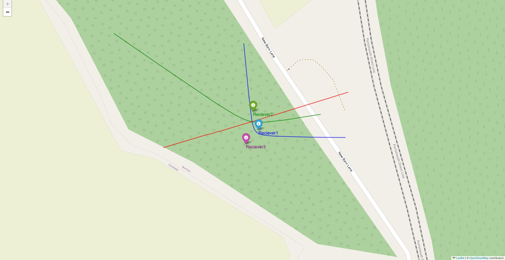

# Raspberry Pi Audio Geolocation

This repository demonstrates a proof-of-concept for using Raspberry Pi based receivers to perform Time Difference of Arrival (TDOA) calculations on audio signals to geolocate the emitter. Vaguely inspired by Ukraine's SkyFortress system, I wanted to see how easy it might be to implement the skeletal - but ultimately extendable -  workings of a cheap audio geolocation system using Raspberry Pi. This project offers the outline of a workable system for geolocating pulses of audio using Raspberry Pi receivers utilising cheap GPS modules and simple omnidirectional microphones. 

---

## Table of Contents

1. [Introduction](#introduction)
2. [Hardware Description](#hardware-description)
3. [Setup Guide](#setup-guide)
   - [Receiver Setup](#receiver-setup)
   - [Server Setup](#server-setup)
4. [Running the Project](#running-the-project)
   - [Step-by-Step](#step-by-step)
   - [TDOA Calculation](#tdoa-calculation)
   - [Visualization](#visualization)
6. [Future Work](#future-work)

---

## Introduction

Time Difference of Arrival (TDOA) is a technique used to locate a signal source by analyzing the time delay of the signal reaching multiple receivers. This project demonstrates how inexpensive hardware and Python can implement this geolocation technique for pulses of audio signals. 

> For more complex detection problems, additional receivers and streaming of audio data would be necessary. The former would be an easy alteration to this code base, the latter more complex. 

---

## Hardware Description

At its most simple, this project requires two receivers to detect and process audio signals, a server to process their outputs, and some form of generating a consistent audio signal. It may also be necessary to add in a WiFi AP to create a LAN if you are out of domestic WiFi range (I used a Pi Zero with a USB WiFi adaptor). 

### Receivers

- **Raspberry Pi**: Each receiver uses a Raspberry Pi to collect and process data.
- **GPS Module**: Provides precise timing information via PPS (Pulse Per Second) signals.
- **Omnidirectional USB Microphone**: Captures audio signals for TDOA calculations.


*Figure 1: Hardware setup showing Raspberry Pi with GPS module and omnidirectional microphone.*

### Server

- **Laptop or Desktop Computer**: Runs the central processing node, which receives data from the receivers, performs TDOA calculations, and visualizes the results.

---

## Setup Guide

This section explains the hardware and software setup required to replicate the project.

### Receiver Setup

#### Configure SSH and VNC on the Raspberry Pi

1. Use the Raspberry Pi Imager to configure networking and enable SSH before burning the OS onto the SD card. I used Bullseye, as I have repeated issues with version clashes in the newest release. 
2. Assign unique hostnames to each Raspberry Pi to simplify network management. **Make sure the server code is updated to reflect these.**
3. Start up your Pi.
4. SSH into the Raspberry Pi once it's on the network.
5. Access configuration settings via `sudo raspi-config`, then enable VNC and set the resolution:
   - **Interface Options** → **Enable VNC**
   - **Display Options** → **Set VNC resolution**
   - Finish and reboot.

#### GPS and PPS Setup

The use of GPS in this project is pretty self-explanatory, but 'PPS' might not be so obvious. 'Pulse Per Second' is a highly accurate timing signal service provided by GPS, which facilitates extremely accurate timing and synchronization between devices. In our case the receivers. This synchronization is central to TDOA. There are alternatives, but using PPS saves a lot of hassle.

##### Wiring the GPS Module

1. Identify the pins on your GPS module:
   - TX: Transmit Data
   - PPS: Pulse Per Second
   - GND: Ground
   - VCC: Power
2. Connect the GPS pins to the Raspberry Pi GPIO as follows:
   - TX (GPS) → RX (Raspberry Pi)
   - PPS (GPS) → GPIO (e.g., GPIO 18, pin 12)
   - GND → GND
   - VCC → 3.3V or 5V (per module specifications).

##### Configure the Raspberry Pi

1. Enable UART and PPS:
   ```bash
   sudo nano /boot/config.txt
   ```
   Add:
   ```
   enable_uart=1
   dtoverlay=pps-gpio,gpiopin=18
   ```
2. Reboot the Raspberry Pi.
3. Install required packages:
   ```bash
   sudo apt update && sudo apt upgrade
   sudo apt install gpsd gpsd-clients pps-tools chrony portaudio19-dev
   ```

##### Configure GPSD and Chrony

GPSD is the GPS Daemon we will be using, and Chrony is the timing software. If either are not on your device, please install them to follow the instructions below.

1. Edit GPSD configuration:
   ```bash
   sudo nano /etc/default/gpsd
   ```
   Set:
   ```text
   DEVICES="/dev/serial0"
   GPSD_OPTIONS="-n"
   ```
2. Disable serial-getty service:
   ```bash
   sudo systemctl stop serial-getty@ttyS0.service
   sudo systemctl disable serial-getty@ttyS0.service
   ```
3. Remove `console=serial0` references from `/boot/cmdline.txt`.
4. Configure Chrony:
   ```bash
   sudo nano /etc/chrony/chrony.conf
   ```
   Add:
   ```
   refclock SHM 0 offset 0.5 delay 0.2 refid GPS
   refclock PPS /dev/pps0 poll 3 refid PPS
   ```
5. Restart Chrony:
   ```bash
   sudo systemctl restart chrony
   ```
6. Verify configuration:
   - Run `gpsd` to confirm GPS data is received.
   - Run `chronyc sources` to check PPS synchronization.

#### Python Environment

Now the hardware is configured, we need to get the processing software setup. I've used Python in this example, utilising PyAudio to perform the fourier transform and signal detection. 

1. Install PyAudio dependencies:
   ```bash
   sudo apt install libportaudio2 libportaudiocpp0 portaudio19-dev
   ```
2. Create a virtual environment:
   ```bash
   python3 -m venv tdoa_env
   source tdoa_env/bin/activate
   ```
3. Install the dependencies:
   ```bash
   pip install -r receiver-requirements.txt
   ```

### Server Setup

The server processes information from the receiver nodes and generates visualizations of the TDOA hyperbolas. Follow these steps to set it up.

#### Configure the Laptop for VNC Access

1. Install the VNC Viewer application to remotely access each Raspberry Pi.

#### Python Environment

1. Clone the repository and navigate to the directory.
2. Create a virtual environment:
   ```bash
   python3 -m venv tdoa_server
   source tdoa_server/bin/activate
   ```
3. Install the dependencies:
   ```bash
   pip install -r server-requirements.txt
   ```
4. Run the `tdoa_server.py` script to process receiver data:
   ```bash
   python3 tdoa_server.py
   ```

---

## Running the Project

## Step-by-Step

1. **Set Up the Receivers**
   - VNC into each Raspberry Pi and set the `main.py` script running.
2. **Start the Central Node**
   - On the central node (laptop/desktop), run the `tdoa_server.py` script.
3. **Generate a Signal**
   - Produce an audio signal at the target frequency (e.g., 4000 Hz) within the area covered by the receivers. I used a CO2 air pistol for this. 
   - Open the html file that was generated on your server and view generated hyperbolic curve(s) and source localization on the visualization map.
   
### TDOA Calculation

The Python script `tdoa_server.py` implements the core TDOA calculations. At its most simple, this works by producing a curve between the receivers where if every point on this curve was the source of an emission *the time difference of arrival of this signal between the receivers would be constant*. For a slightly more technical understanding, please see this [section](https://en.wikipedia.org/wiki/Hyperbola#Definitions) of a relevant wikipedia article. If you swap *a* here for the time difference derived distance between the receivers instead of the physical distance, you will get the concept. 

> This script performs some basic checks to ensure the hyperbolic curve is valid before plotting. 

#### Key Parameters

- **Receiver Locations**: Latitude and longitude of two receivers.
- **Delta Time (Δt)**: Time difference of arrival between the receivers.
- **Propagation Speed (v)**: Speed of sound (default: ~343 m/s).

### Visualization

The project uses the Folium library to visualize TDOA hyperbolas and receiver locations on an interactive map. As there are only two receivers at present, there is only one curve. In all instances I tested, the emitter rests upon the curves generated. 

#### Example Output


*Figure 2: Hyperbolic curve for two receivers.*

---

## Future Work

- Add support for more receivers to enable true geolocation.
- Transition to real-time TDOA analysis using streaming data.

---

